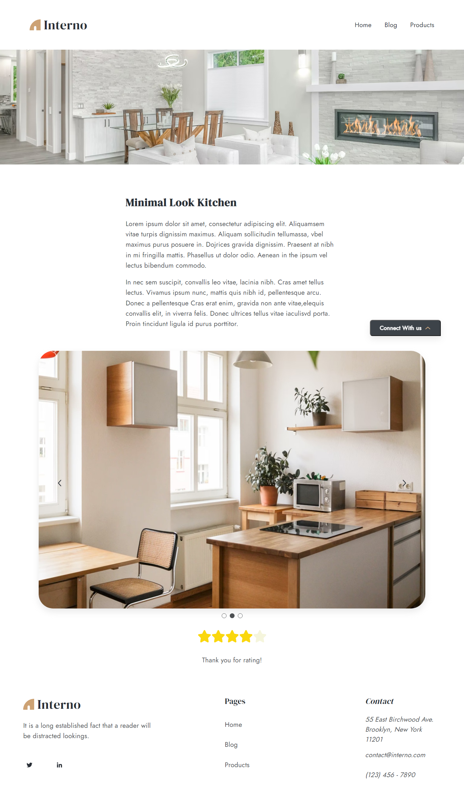

# [SiteInterno](https://asalferova.github.io/SiteInterno/ "Ссылка на сайт")

# Содержание

1. <a href="#description">Описание проекта</a>
2. <a href="#setup">Настройка проекта</a>
3. <a href="#stack">Технологии</a>
4. <a href="#screenshots">Скриншоты сайта</a>
   


<h2 id="description">Описание проекта</h2>

Информационный портал с продуктовой витриной и блогом. 

Основные функции сайта: предоставление информации о продуктах, публикация статей в блоге и возможность обратной связи для пользователей.

Он состоит из шести основных страниц:

  1. Главная страница: Входная точка сайта, где представлены промо-блок, карточки статей и продуктов, а также информация о проекте.
  2. Страница блога: Содержит карточки статей с пагинацией, блок с последней статьей.
  3. Страница статьи: Представляет полные версии статей. Статьи можно фильтровать по тегам на странице, id при переходах. Реализована бесконечная лента с использованием Intersection Observer.
  4. Страница продуктов: Представляет карточки продуктов расположенные в мозаику, которые можно фильтровать по тегам. Реализована пагинация.
  5. Страница продукта: Содержит полное описание продукта, включая слайдер изображений. Пользователи могут оставить оценку продукта, оценка хранится в localStorage.
  6. Страница 404: Отображается, когда пользователь пытается перейти на страницу, которая не существует на сайте.
  7. Все страницы сайта содержат форму обратной связи с валидацией и автоматической фокусировкой на неверных полях.

Проект адаптирован под все экраны.


<h2 id="setup">Настройка проекта</h2>
```
npm install
```

### Компилирует и выполняет перезагрузку для разработки
```
npm run serve
```

### Компилирует и минимизирует для продакшн
```
npm run build
```

### Проверка и исправление файлов
```
npm run lint
```

### Настройка конфигурации
See [Справочник по конфигурации](https://cli.vuejs.org/config/).


<h2 id="stack">Технологии</h2>

   * Vue3 Composition API
   * Vue CLI
   * Vue Router
   * Pinia
   * axios, MOKKY.DEV
   * scss и sass-loader
   * eslint, prettier
   * Babel, Autoprefixer
   * vue3-observe-visibility

<h2 id="screenshots">Скриншоты сайта</h2>

1. Скриншот главной страницы
 


2. Скриншот формы обратной связи


3. Скриншот страницы блога


4. Скриншот страницы со статьями


5. Скриншот страницы с продуктами
 


6. Скриншот страницы с описанием продукта



7. Скриншот страницы 404


## Проверка HTML валидатором

Скриншот проверки HTML валидатором W3C:


